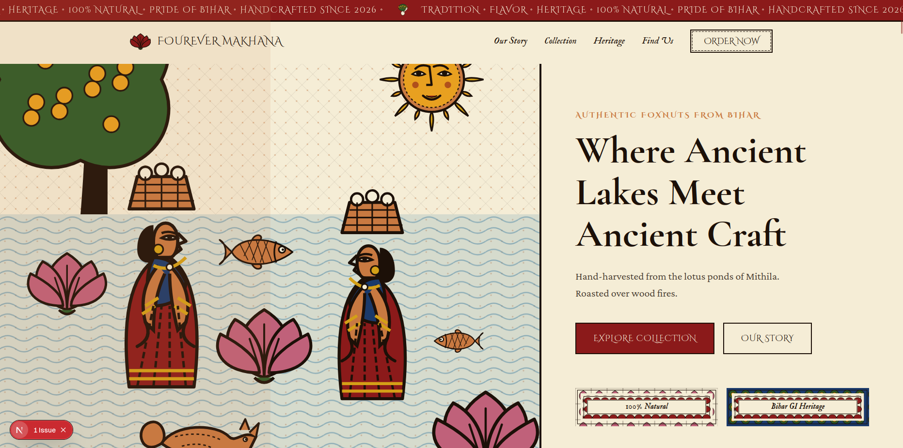

# Fourever Makhana

## The Pride of Bihar
**Fourever Makhana** brings the authentic, time honored tradition of Bihar's finest foxnuts to the modern world. Hand harvested from the ancient, mineral rich lotus ponds of Mithila, every batch of our makhana carries a legacy of craft and dedication that spans six generations.

We believe that true luxury lies in its roots. Our makhana isn't just a snack; it's an agricultural treasure. Roasted over traditional wood fires to achieve an unparalleled, natural crispness, Fourever preserves the purity and flavor that industrial processing leaves behind. 

## The Aesthetic
Our digital presence is a love letter to **Mithila (Madhubani) Painting**, a vibrant folk art style native to the very region our foxnuts are grown. 

From the intricate geometric patterns bordering our packaging to the custom lotus-bud cursor and deep, earthy color palette (Crimson, Ochre, Ink, and Ivory), the Fourever experience is designed to transport you directly to the vibrant bazaars and tranquil ponds of Patna and Mithila. 

---

*Built with Next.js & Tailwind CSS for lightning-fast performance and seamless responsiveness.*
